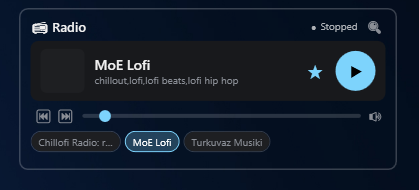
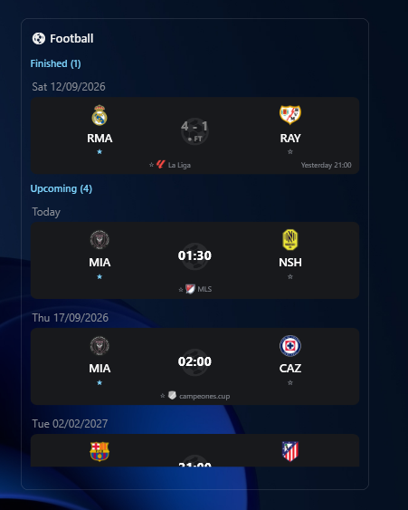
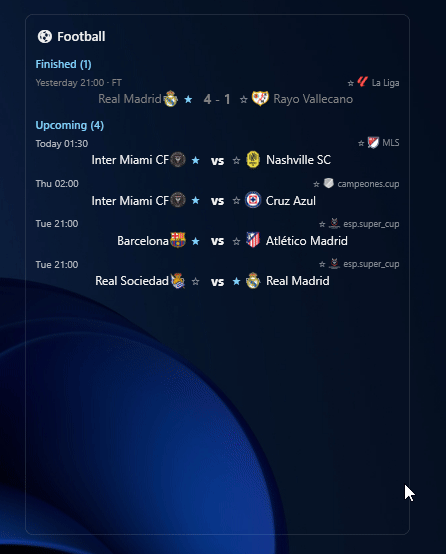
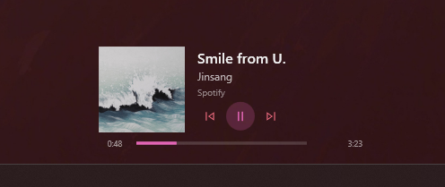
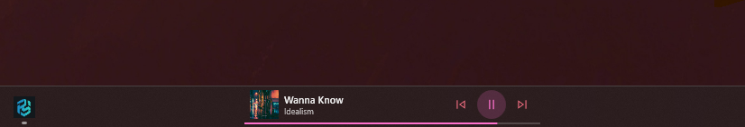
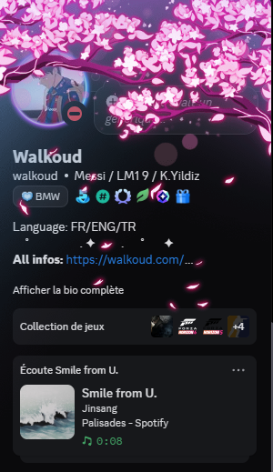

# Palisades — Your desktop, finally organized

  
  
  
  
  

  

  <b>Containers</b> for your icons · <b>live gadgets</b> on your wallpaper · <b>total theming</b> · zero clutter.

  <a href="https://github.com/Walkoud/Palisades/releases"><b>⬇ Download the latest release</b></a>

---

## At a glance

| | |
|---|---|
| 📦 **Containers** | Group shortcuts, files and folders into resizable, recolorable boxes that remember their position on every monitor and resolution. |
| 🧩 **Gadgets** | Clock, system monitor, web radio, live football scores and Now Playing — pinned straight onto your wallpaper. |
| 🎨 **Theming** | 8 built-in presets, custom `.xaml` imports, per-container colors, gradients, opacity, radius, fonts. |
| 📸 **Snapshots** | Save and restore your whole layout in one click. |
| 🪄 **Auto-organize** | Sort shortcuts automatically by type: programs, documents, images, music, archives, links, folders. |

  

---

## 📦 Containers

Drag folders and files into groups. Rename, recolor, reorder, hide, or tune transparency per container. Filter contents by file type or custom search. Restore the full layout from a snapshot whenever you want.

**Curtain mode** turns any container into a sliding panel docked to a screen edge — hover to open, move away and it slides shut.

  
  

**Android Folders** — frosted 96px tiles à la Android launchers that expand into a centered, fully customizable grid exactly where you click.

  

---

## 📻 Radio gadget

Stream 40,000+ stations free via Radio Browser — no API key. Search, preview, and pin favorites as chips. Volume slider, previous/next favorite, live status, optional Now Playing + Discord integration.

  

---

## ⚽ Football gadget

Live scores, upcoming fixtures and finished results with team crests, follow your clubs, two card styles (dark cards or classic rows), match details on click, optional Discord presence when your team plays live.

  
  

---

## 🎵 Now Playing

A live media widget that follows whatever plays on your PC — Spotify, browser, any app. Five layouts (Classic, Compact, Fluent, Taskbar, Taskbar Slim), album cover, 12 accent colors, resizable, auto-hides in fullscreen. Pin it as a slim bar in front of your taskbar, follow the active source automatically or pin one manually — the choice survives reboots and backup export/import.

  

  

**Discord Rich Presence** — broadcast what you listen to from any source: title, artist, app, elapsed timer, album cover, clickable links, presence buttons, private mode, per-app priority with auto-fallback.

  

---

## 🖥️ Dashboard

Everything is configurable from the Arctic Shelter dashboard: containers, gadgets, themes, snapshots, plugins, Discord, global settings.

  

---

## 🚀 Quick start

1. Download the installer from [Releases](https://github.com/Walkoud/Palisades/releases) (or grab the portable `.zip`)
2. Install and launch — Palisades lives in your system tray
3. Drag desktop shortcuts into a container
4. Right-click a container header to rename, recolor or tweak it
5. Open the **Dashboard** from the tray icon for global settings
6. Enable **Start with Windows** to keep it running discreetly

---

## 🧩 Plugins

A built-in plugin manager enables, disables and configures every gadget and extension. Developers: see [documentation/plugin_developer_guide.md](documentation/plugin_developer_guide.md). Users: see [documentation/user_guide.md](documentation/user_guide.md).

---

## Built with

- .NET 8 / WPF
- [Material Design In XAML](https://github.com/MaterialDesignInXAML/MaterialDesignInXamlToolkit)

## Credits

Inspired by [Twometer's NoFences](https://github.com/Twometer/NoFences) and [Stardock's Fences](https://www.stardock.com/products/fences/).

## Star History

