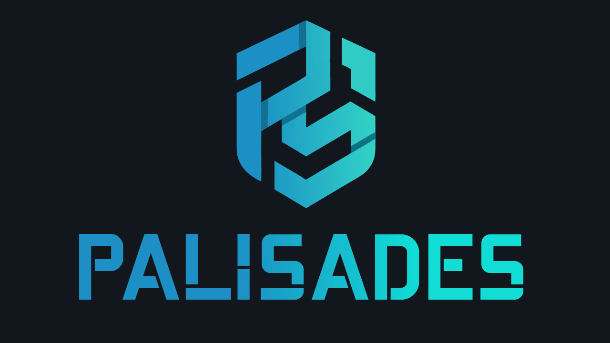
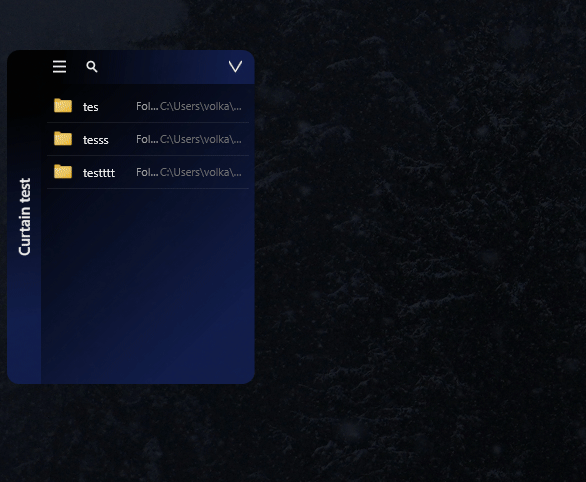
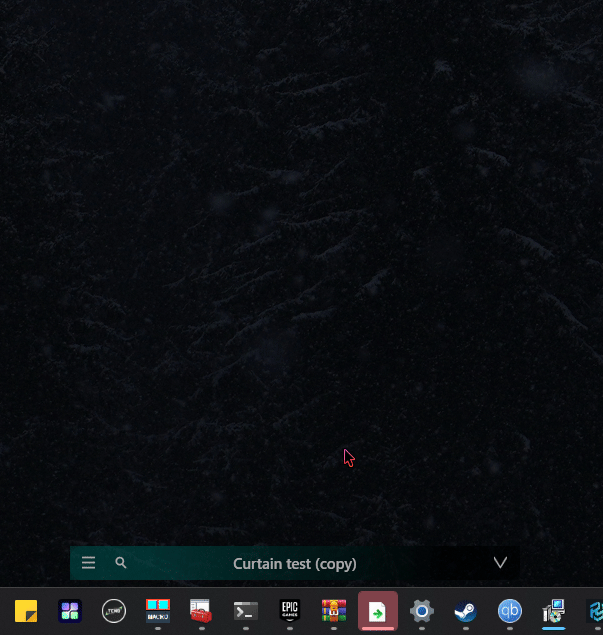
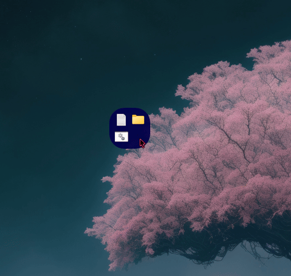
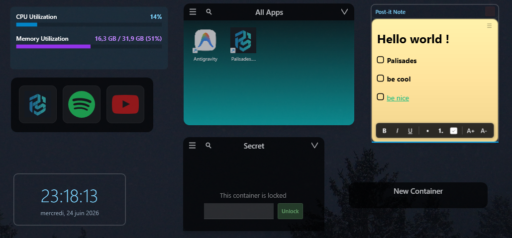
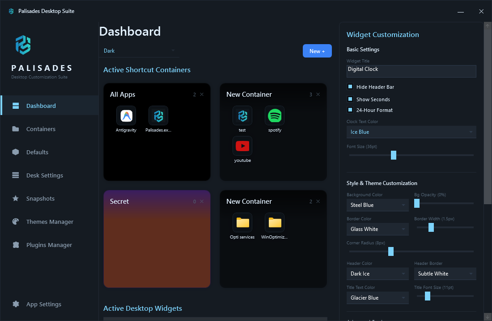

# Palisades

  
  
  

  

Palisades declutter your Windows desktop. Drop icons into organized containers, add live gadgets, and customize everything — no more hunting through a sea of shortcuts.

---

## Features

**Containers** — Drag folders and files into resizable groups. Rename, recolor, reorder, hide, or set transparency per container. Each container remembers its position across monitors and resolutions.

**Gadgets** — Pin a live clock or system monitor (CPU, RAM, disk) directly on your wallpaper. Plugin system lets you add more.

**Endless customization** — Customize header, body, title, and label colors on every container. Gradient backgrounds with angle control. Adjustable opacity. Custom border radius, fonts, and sizes.

**Themes** — 8 built-in color presets. Import custom `.xaml` themes. Full GUI theme engine: change background, text, accent colors globally.

**Snapshots** — Save and restore your entire layout (containers, positions, colors, gadgets) instantly.

**Auto-organize** — Sort shortcuts into containers automatically by type: programs, documents, images, music, archives, links, folders.

**Curtain mode** — Transform a container into a sliding panel docked to the edge of your screen. On hover, it slides open; move away and it slides shut — keeping your desktop clean while keeping shortcuts one hover away.

  
  

**Android Folders** — New container type inspired by Android launchers: a frosted 96px tile that expands into a centered, fully customizable grid panel right where you click.

  

**Plugins** — Plugin manager to enable/disable and configure gadgets and extensions.

**Filters** — Show only what you need. Filter a container by file type or custom search.

**Start with Windows** — Option to launch automatically on boot, runs discreetly in the system tray.

**Open source** — MIT license. Fork, modify, contribute.

  

## Quick start

1. Download the latest installer from [Releases](https://github.com/Walkoud/Palisades/releases)
2. Install and launch — Palisades runs in your system tray
3. Drag desktop shortcuts into a container
4. Right-click a container header to rename, recolor, or tweak it
5. Open the Dashboard from the tray icon for global settings

  

## Built with

- .NET 8 / WPF
- [Material Design In XAML](https://github.com/MaterialDesignInXAML/MaterialDesignInXamlToolkit)

## Credits

Inspired by [Twometer's NoFences](https://github.com/Twometer/NoFences) and [Stardock's Fences](https://www.stardock.com/products/fences/).
